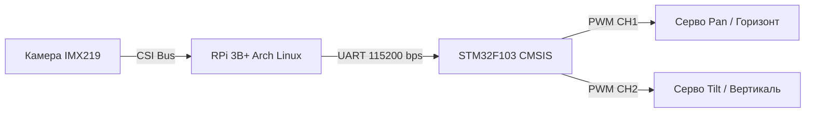

# Arch-CV-Tracker-STM32

### Система автономного оптического слежения на базе гетерогенной архитектуры.

## Обзор проекта

Разработка программно-аппаратного комплекса для обнаружения и динамического сопровождения объектов в реальном времени. Система разделена на вычислительный узел (High-level) и исполнительный контроллер (Low-level), что обеспечивает высокую скорость реакции и стабильность управления.

## Архитектура системы
Система реализована по принципу распределенного управления с разделением вычислительной нагрузки:

### Алгоритм работы (Data Flow):

1. **Захват (Capture)**: Камера IMX219 передает «сырой» видеопоток на Raspberry Pi через интерфейс CSI. Это минимизирует задержки по сравнению с USB-камерами.

2. **Анализ (Vision Processing)**: На Arch Linux запускается процесс обработки. Нейросеть (или каскады Хаара) находит объект и вычисляет его отклонение от центра кадра в пикселях ($\Delta X, \Delta Y$).
  
3. **Трансляция (Communication)**: Сформированный пакет координат отправляется через UART. Мы используем скорость 115200 бод для обеспечения минимального пинга между узлами.
  
4. **Управление (Control)**: STM32 принимает данные по прерыванию UART. Код на CMSIS мгновенно пересчитывает координаты в длительность импульса ШИМ.
  
5. **Исполнение (Actuation)**: Таймеры STM32 генерируют стабильный сигнал 50 Гц, заставляя сервоприводы SG90 повернуть камеру так, чтобы объект снова оказался в центре кадра.

### С чем предстоит работать
  
1. High-Level Unit: Raspberry Pi под управлением Arch Linux ARM.

       Задачи: Обработка видеопотока, инференс нейросети (YOLO/MobileNet), вычисление вектора смещения цели.
2. Low-Level Control: Custom PCB на базе STM32.

       Прошивка: Написана на C с использованием CMSIS (без HAL/LL) для прямого манипулирования регистрами.

       Задачи: Управление 2-осевым подвесом (Pan-Tilt) через аппаратный ШИМ, обработка прерываний связи, фильтрация сигналов управления.

3. Hardware: Собственная разводка печатной платы, 3D-печатный корпус и механизм позиционирования.

## Команда разработчиков (Team)

**[Даниил Светашов] — Team Lead & Embedded Linux Engineer**

  - Развертывание и глубокое конфигурирование Arch Linux ARM на Raspberry Pi 3B+.

  - Разработка низкоуровневых драйверов периферии (PWM, UART) для STM32F103 на базе CMSIS.

  - Проектирование протокола обмена данными между управляющим компьютером и контроллером приводов.

  - Системная интеграция всех узлов комплекса.

**[Андрей Тимофеев] — Software & Computer Vision Engineer**

  - Разработка модулей захвата и обработки видеопотока с камеры IMX219 (OpenCV).

  - Реализация алгоритмов детекции и сопровождения объектов (Tracking).

  - Математическое моделирование и программная реализация алгоритма наведения (П-регулятор).

  - Оптимизация нагрузки на CPU Raspberry Pi для обеспечения высокого FPS.

**[Андрей Кондрацкий] — Hardware & Circuit Designer**

  - Разработка принципиальной схемы системы управления и распределения питания.

  - Проектирование и расчет параметров питания для сервоприводов SG90 и микроконтроллера.

  - Разводка печатной платы (PCB) и монтаж электронных компонентов.

  - Обеспечение помехозащищенности линий связи UART.

**[Егор Гавриленко] — Industrial Designer & Mechanical Engineer**

  - Проектирование двухосевого подвеса (Pan/Tilt) в CAD-системах.

  - Оптимизация веса конструкции для минимизации нагрузки на сервоприводы SG90.

  - Подготовка моделей к аддитивному производству (3D-печать) и финальная сборка механических узлов.

  - Юстировка оптической оси камеры.

**[Кирилл Яковенко] — QA Engineer & Technical Writer**

  - Проведение комплексных испытаний системы на точность и скорость наведения.

  - Написание технической документации и ведение логов разработки (Changelog).

  - Подготовка отчетности по результатам полевых тестов (Bug tracking).
